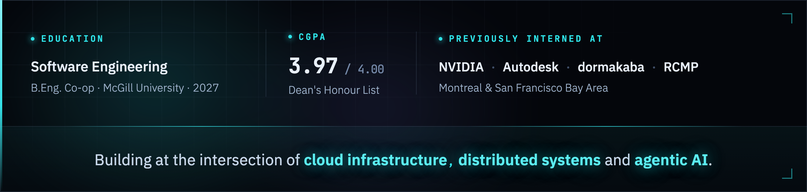

<h1 align="center">
  
</h1>

  

  
  &nbsp;&nbsp;
  
  &nbsp;&nbsp;
  

---

<h3 align="center">Languages</h3>

  
  
  
  
  
  
  
  
  

<h3 align="center">Cloud &amp; Infrastructure</h3>

  
  
  
  
  
  
  
  
  

<h3 align="center">Frameworks &amp; Databases</h3>

  
  
  
  
  
  
  
  
  
  

<h3 align="center">AI &amp; Developer Tools</h3>

  
  
  
  
  
  
  
  

---

<i>From concept to execution, coding my way to innovation.</i>

